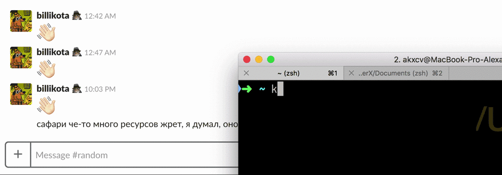

# krasivo

> Russian for: prettily



## Installation

Install with [yarn](https://yarnpkg.com):
```sh
yarn global add krasivo
```

Or, with npm:
```sh
npm i -g krasivo
```

## Usage

To use via command line:
```sh
krasivo [your text] [foreground string] [background string]
```

To use in JS code:
```js
import krasivo from 'krasivo'

console.log(krasivo('hello', 'x', ' '))
```

## API

To get help with the API, run:
```sh
krasivo --help
```

### Available options:

#### - `shortEmoji` (default: `true`)
When true, emoji names like `:no_good:` are converted to Unicode emoji symbols.

**CLI usage**:
```sh
krasivo hello :no_good: ' ' --short-emoji
# or:
krasivo hello :no_good: ' ' -e
# To disable:
krasivo hello :no_good: ' ' --no-short-emoji
```

**JS usage**:
```js
krasivo('hello', ':no_good:', ' ', { shortEmoji: true })
// To disable:
krasivo('hello', ':no_good:', ' ', { shortEmoji: false })
```

> Slack limits message length, and after the limit is broken, the only way to send the
message is to
send a "code snippet". The problem is, every symbol in an emoji name is counted as a
separate character. `shortEmoji` feature allows you to use any emoji in your message by
converting emoji names to actual Unicode emoji symbols, which are all 1 character long in
Slack.

#### - `defaultSkinTone` (default: `undefined`)
When given a number (typically from 2 to 6), adds a skin tone to emoji that support skin tone
variations. You can always specify a skin tone yourself (`:no_good::skin-tone-6:`), this will
override the value specified in `defaultSkinTone`. It's best to configure this option in a [local
config file](#local-config-file).

**CLI usage**:
```sh
krasivo hello :no_good: ' ' --default-skin-tone=2
# or:
krasivo hello :no_good: ' ' -s 2
```

**JS usage**:
```js
krasivo('hello', ':no_good:', ' ', { defaultSkinTone: 2 })
```

### Skin colours

Skin colours are supported in Slack style:

`":no_good:"` => 🙅

`":no_good::skin-tone-2:"` => 🙅🏻

`":no_good::skin-tone-3:"` => 🙅🏼

`":no_good::skin-tone-4:"` => 🙅🏽

`":no_good::skin-tone-5:"` => 🙅🏾

`":no_good::skin-tone-6:"` => 🙅🏿

## Local config file

Krasivo CLI looks for a `.krasivorc` YAML file in your home directory. For example, to configure
a default skin tone, and to disable emoji replacement, create the following file:

```yaml
# ~/.krasivorc
options:
  defaultSkinTone: 2
  shortEmoji: false
```

## License

MIT
